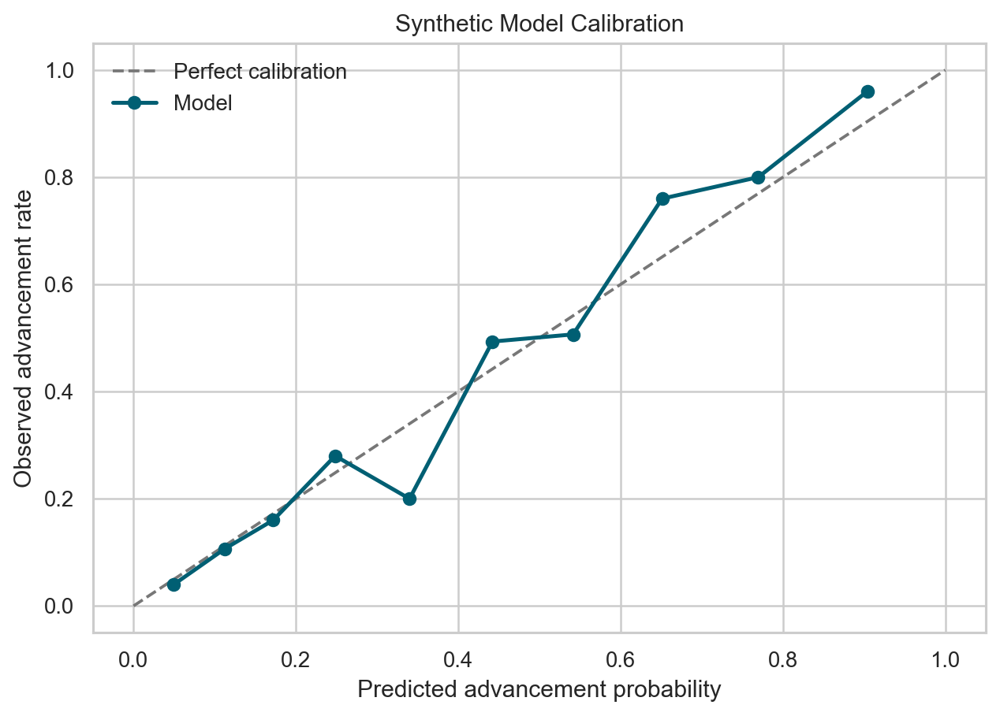
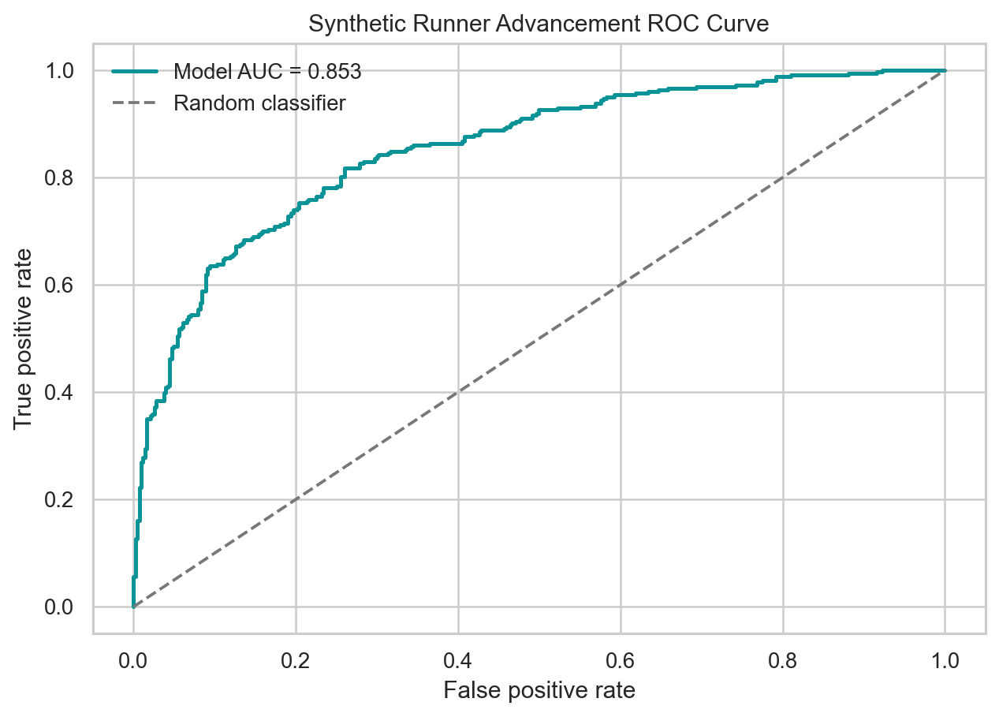
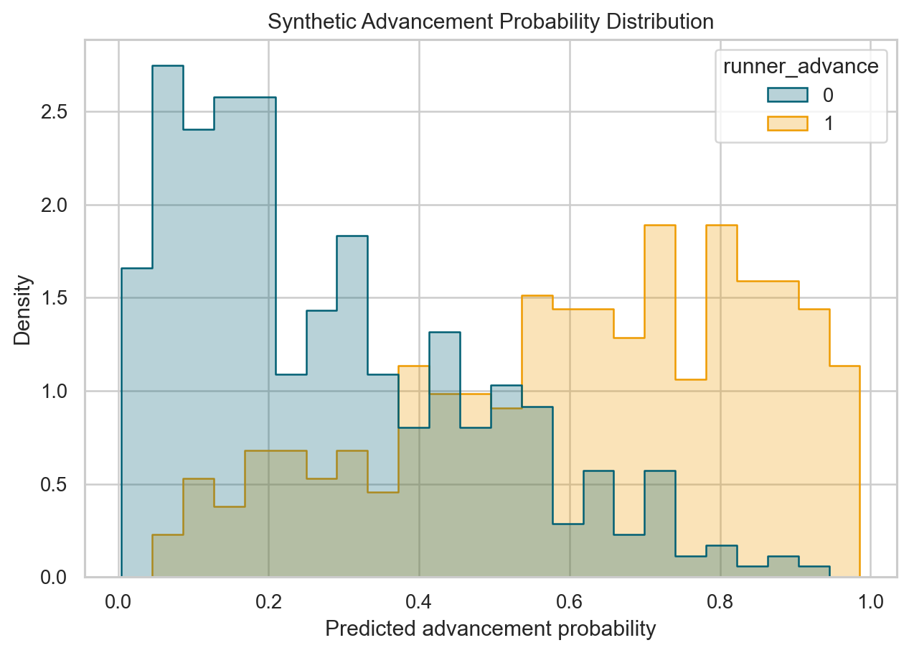
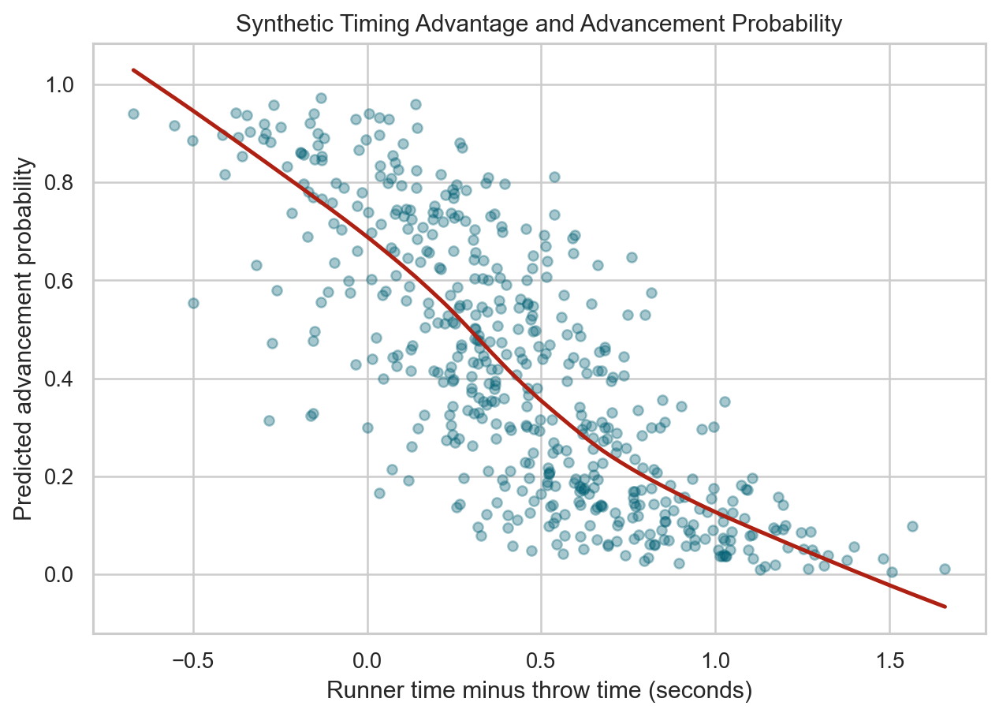
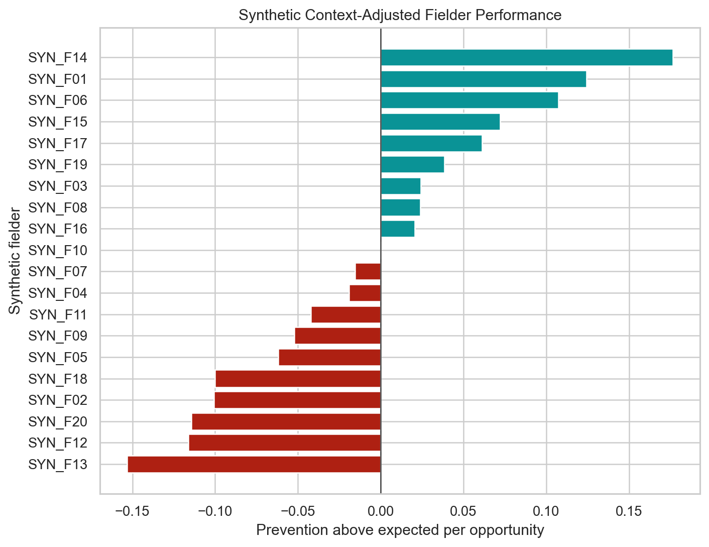

# Outfield Runner Advancement

## Introduction

Outfield sacrifice plays combine a runner's decision, batted-ball trajectory, fielder positioning, catch difficulty, throwing ability, and the distance to the target base. A raw advancement rate describes what happened, but it does not separate difficult opportunities from routine ones.

This project studies outfield runner advancement through two connected components:

1. **Runner advancement probability modeling** estimates the probability that a runner successfully advances on an outfield catch.
2. **Context-adjusted fielder evaluation** compares actual outcomes with the expected difficulty of each opportunity to evaluate how well an outfielder prevents advancement.

The two components share the same physical and contextual features. The first produces calibrated play-level probabilities. The second uses comparable historical plays to determine whether a fielder performed above or below expectation.

## Baseball Context

On a caught fly ball, the runner must decide whether there is enough time to reach the next base before the throw. Important factors include the ball's hang time and landing location, the fielder's starting and catching positions, throwing speed, the runner's sprint speed, and whether the throw is directed to third base or home plate.

Directly ranking fielders by runner advancement rate can be misleading. A center fielder who handles mostly deep catches may face more difficult throws than a corner outfielder receiving shorter opportunities. The project therefore treats prediction and evaluation as separate but dependent tasks.

## Data

The public repository uses `data/synthetic_sample.csv`, a small synthetic dataset created only to demonstrate the code. It contains no real games, players, tracking observations, or recruiting-assessment records.

Each row represents one opportunity for a runner on second or third base to advance after an outfielder records an out. The demonstration schema includes:

- batted-ball exit velocity, launch angle, distance, and hang time
- fielder position, starting coordinates, and catching coordinates
- estimated fielder throwing speed
- estimated runner sprint speed
- runner starting base
- binary advancement outcome

The complete schema is documented in `data/data_dictionary.csv`. Users can adapt the workflow to public or appropriately licensed tracking data that follows the same structure.

## Part 1 Runner Advancement Probability

### Feature engineering

The probability model combines observed variables with physical features derived from the play:

- **Throw distance:** straight-line distance from the catch point to third base or home plate.
- **Runner time:** theoretical time required to cover 90 feet at the runner's estimated sprint speed.
- **Throw time:** theoretical ball-travel time using throw distance and estimated throwing speed.
- **Time difference:** runner time minus throw time.
- **Speed ratio:** runner sprint speed divided by fielder throwing speed.
- **Fielder run distance:** distance between the fielder's starting and catching positions.
- Nonlinear transformations of exit velocity, launch angle, hit distance, and the runner's available window.

These values simplify a complicated play into interpretable measurements of opportunity and timing. They do not model transfers, cutoff throws, acceleration, reaction time, or the runner's lead.

### Modeling objective

The target is `runner_advance`, where `1` means the runner successfully advanced and `0` means the runner was held or failed to advance. The model should output a probability rather than only a binary classification.

Probability quality should be evaluated with:

- Log Loss
- Brier Score
- ROC AUC
- calibration curves

`model_training.ipynb` demonstrates feature construction and a complete probability-modeling workflow. The notebook is intentionally data-source agnostic so private or licensed data can remain outside the repository.

## Part 2 Context Adjusted Fielder Evaluation

### Opportunity difficulty

A fielder should not receive the same evaluation for every opportunity. The project estimates the expected prevention probability of each play using K-nearest neighbors. Each event is compared with historical plays having similar batted-ball, runner, catch-location, and timing features.

For a play with feature vector `x`, the nearest historical plays provide an empirical advancement probability:

```text
expected advance probability = mean advancement outcome among similar plays
expected prevention probability = 1 - expected advance probability
```

### Performance above expectation

For plays with known outcomes:

```text
actual prevention = 1 - runner advance
prevention above expected = actual prevention - expected prevention probability
```

A positive average indicates that the fielder prevented more advancements than expected given the opportunities faced. A negative average indicates performance below the contextual expectation.

`fielder_evaluation.ipynb` demonstrates the similarity model, play-level expected probabilities, and a fielder-level summary containing:

- number of opportunities
- actual advancement rate
- expected advancement rate
- prevention above expected
- context-adjusted rank

The evaluation should always report a minimum-opportunity threshold and uncertainty. Small samples can produce unstable rankings.

## Results

The figures below are generated from a larger simulated dataset with fictional player IDs and a known synthetic outcome process. They demonstrate the intended analysis and presentation workflow; they do not describe real players, real games, or results from the original private assessment.

### Probability model demonstration

The calibration curve compares predicted advancement probability with the observed rate within probability groups. A useful probability model should remain close to the diagonal reference line.



The ROC curve shows how well the model separates successful advances from holds across decision thresholds. It complements calibration but does not show whether the probability values themselves are accurate.



The probability distribution shows how the model separates the two observed outcomes while retaining uncertainty for overlapping plays.



The timing comparison connects an interpretable engineered feature with the model output. Positive values mean the theoretical runner travel time is longer than the direct throw time; the full model also uses trajectory, distance, speed, and position variables.



### Fielder evaluation demonstration

The context-adjusted chart compares each synthetic fielder's actual prevention with the expectation from similar historical plays. Values above zero represent more prevention than expected for the opportunities faced, while values below zero represent less prevention than expected.



When applied to a sufficiently large licensed dataset, the project produces two types of results:

1. Calibrated runner-advancement probabilities for individual plays.
2. Context-adjusted fielder summaries that compare actual prevention with expected opportunity difficulty.

The included plots contain only simulated data. No figures derived from private assessment data are included here.

## Limitations

- The direct-throw calculation does not include cutoff players or relay throws.
- Theoretical travel times do not include exchange, release, acceleration, or reaction time.
- KNN estimates depend on feature scaling, the selected value of `k`, and historical sample coverage.
- Fielder rankings require adequate samples and should include uncertainty intervals.
- Tracking-data definitions may vary across providers and competition levels.
- The synthetic dataset is too small for meaningful model evaluation.

## Repository Information

### Structure

```text
outfield-runner-advancement/
├── README.md
├── requirements.txt
├── runner_advance.py
├── generate_plots.py
├── model_training.ipynb
├── fielder_evaluation.ipynb
├── data/
│   ├── README.md
│   ├── data_dictionary.csv
│   └── synthetic_sample.csv
├── plots/
│   ├── advance_probability_distribution.png
│   ├── fielder_performance.png
│   ├── model_calibration.png
│   ├── model_roc_curve.png
│   └── timing_advantage.png
└── tests/
    └── test_features.py
```

### File descriptions

- `runner_advance.py` contains reusable feature engineering, probability metrics, KNN opportunity estimation, and fielder aggregation functions.
- `generate_plots.py` creates the five public demonstration figures from deterministic synthetic data.
- `model_training.ipynb` covers Part 1: preparation, probability modeling, evaluation, and calibration.
- `fielder_evaluation.ipynb` covers Part 2: opportunity difficulty and context-adjusted outfielder evaluation.
- `data/README.md` explains the public-data policy and how to provide another dataset.
- `data/data_dictionary.csv` defines the demonstration schema.
- `data/synthetic_sample.csv` is a non-real example used to test the workflow.
- `plots/` contains demonstration figures generated from synthetic data.
- `tests/test_features.py` checks the core physical-feature calculations.

### Installation

Python 3.10 or newer is recommended.

```bash
python -m venv .venv
source .venv/bin/activate
python -m pip install -r requirements.txt
```

Run the tests:

```bash
python -m pytest
```

Start Jupyter from the repository root:

```bash
jupyter lab
```

Run `model_training.ipynb` before `fielder_evaluation.ipynb` when using a full dataset.

Regenerate all public demonstration figures with:

```bash
python generate_plots.py
```

## Data Availability

The original development data are not distributed with this repository because they were provided for a private recruiting exercise. The original problem statement, submission reports, row-level predictions, and player-specific assessment are also excluded.

The repository publishes only the general methodology, independently organized code, a newly written data dictionary, and synthetic demonstration records. Users are responsible for confirming the license and redistribution terms of any replacement dataset.
